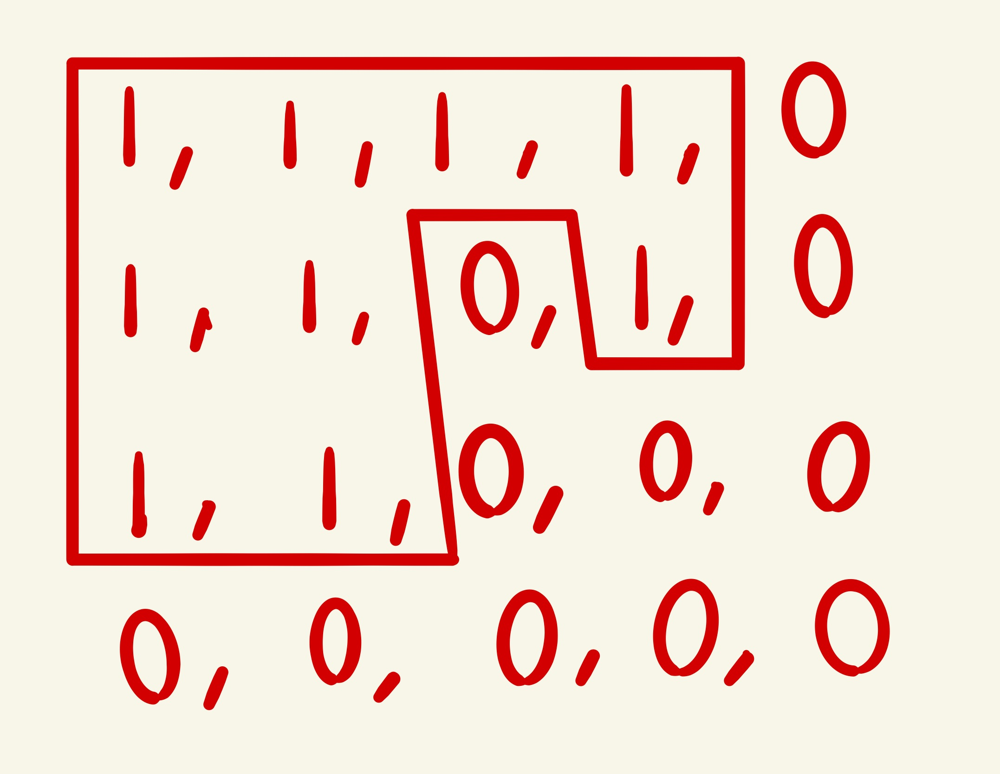
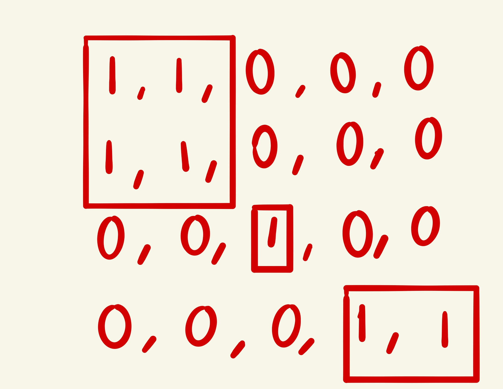

# Count Islands

Given a 2D grid map of `1`s (land) and `0`s (water), count the number of islands. An island is surrounded by water and is formed by connecting adjacent lands horizontally or vertically.

You may assume all four edges of the grid are all surrounded by water.

### Example 1:

Input:

```js
[
  [1, 1, 1, 1, 0],
  [1, 1, 0, 1, 0],
  [1, 1, 0, 0, 0],
  [0, 0, 0, 0, 0],
];
```

Output: `1`

Explanation



### Example 2:

Input:

```js
[
  [1, 1, 0, 0, 0],
  [1, 1, 0, 0, 0],
  [0, 0, 1, 0, 0],
  [0, 0, 0, 1, 1],
];
```

Output: `3`


