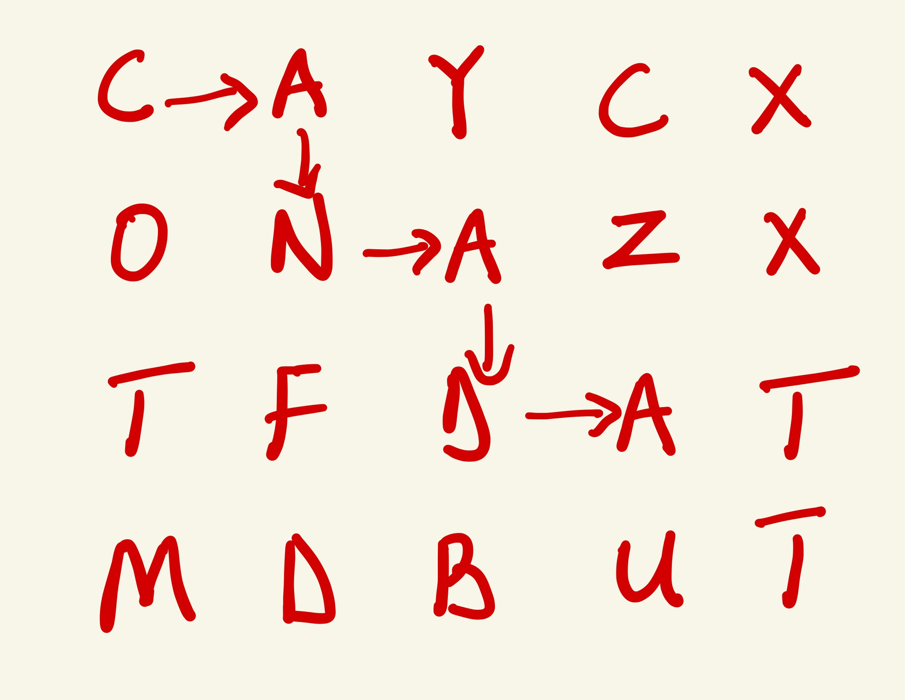
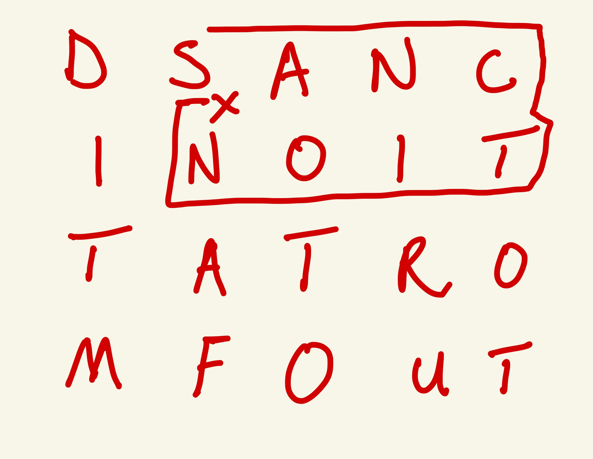

## Word Search

Given an 2D grid map of letters, determine if the given word can be formed in that array. Words are formed by connecting adjacent letters horizontally or vertically.

Return `true` if the word can be formed, `false` otherwise.

A letter cannot be used more than once.

### Example 1

```js
words = [
  ["C", "D", "Y", "C", "X"],
  ["A", "N", "Y", "Z", "X"],
  ["T", "F", "Z", "A", "T"],
  ["M", "D", "B", "U", "T"],
];

word = "CAT";
```

Output: `true`

### Example 2

```js
words = [
  ["C", "A", "Y", "C", "X"],
  ["O", "N", "A", "Z", "X"],
  ["T", "F", "D", "A", "T"],
  ["M", "D", "B", "U", "T"],
];

word = "CANADA";
```

Output: `true`

Explanation


### Example 3

```js
words = [
  ["D", "S", "A", "N", "C"],
  ["I", "N", "O", "I", "T"],
  ["T", "A", "T", "R", "O"],
  ["M", "F", "O", "U", "T"],
];

word = "SANCTIONS";
```

Output: `false`

Explanation



This fails because we've already used `S`
